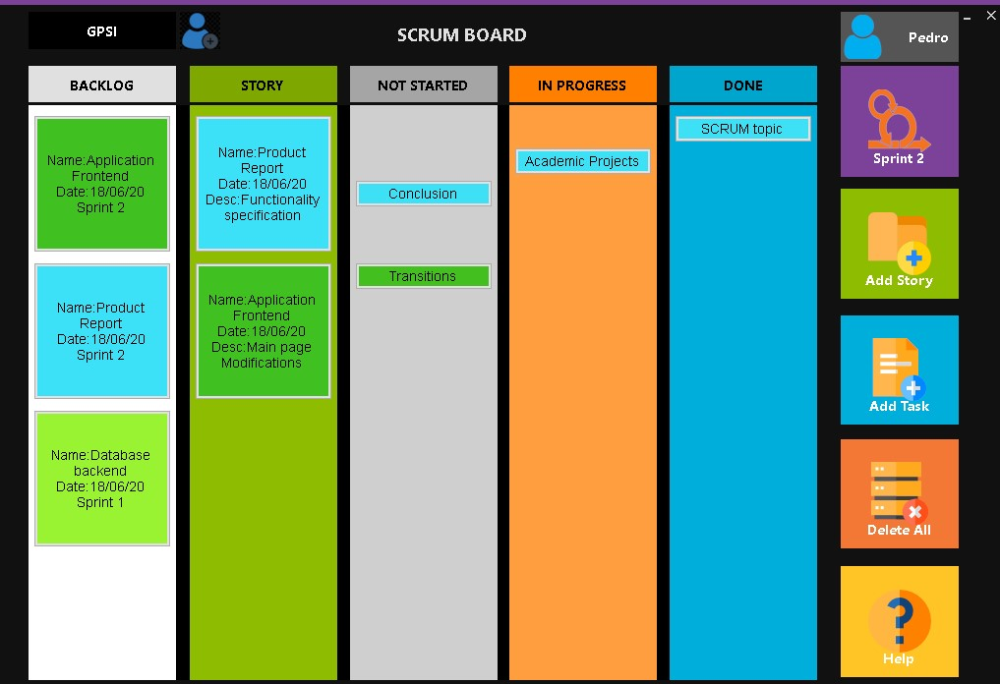
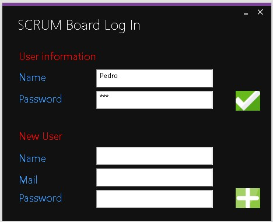
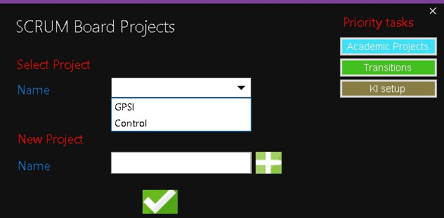
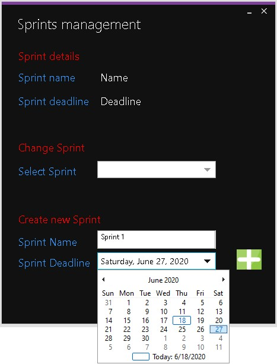

<h1> SCRUM MASTER </h1>

 O SCRUM Board oferece uma interface de login e gestão de elementos num projeto, bem como a gestão do mesmo. Esta funcionalidade de gestão de elementos, vai de encontro com um dos pilares do SCRUM que é o trabalho em equipa. Considerou-se também que o conceito de Product Owner não se aplica tanto em projetos académicos pelo que as funções que este costuma desempenhar (gestão de product backlog) podem ser desempenhadas por qualquer membro pertencente ao projeto. Ainda a pensar num ambiente académico pode assumir-se que um utilizador deve ter forma de "navegar"e gerir variados projetos em simultâneo. Para apoiar isso, o SCRUM Board fornece uma interface que permite suportar esta funcionalidade.

<h1 align="center">
    
</h1>

 

<h1 align="center">
    Guia de utilizador!
</h1>

 Para aceder às funcionalidades do SCRUM Board é necessário criar uma conta. Como
este programa representa uma versão de prova de conceito, para criar uma conta não é
necessário inserir um email válido.

<h1 align="center">
    
</h1>

 

<h1 align="center">
    Gestão de projetos!
</h1>

 Após entrar na conta com sucesso, a janela de gestão de projetos aparece. Nesta janela os variadíssimos projetos que o utilizador criou ou em que foi adicionado podem ser observados. Para criar um projeto, basta preencher o nome desejado na caixa "New project" e carregar no botão de mais.

<h1 align="center">
    
    
</h1>

 

<h1 align="center">
    Sprints!
</h1>

 A cada projeto podem estar associadas várias sprints, as quais podem ser criadas no botão de sprint, diretamente abaixo do ID de utilizador.

<h1 align="center">
    
</h1>

 
<h4 align="center">
    Made with ❤ by pedromiguelcp. Project no longer under development. 🏁
</h4>